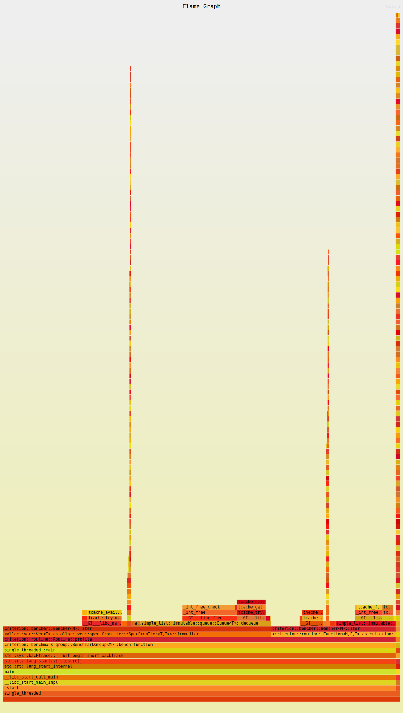

# Lock Free queues

Implement some lock free queues from scratch.

## Run the benchmark

```sh
cargo bench
```

Detailed reports as html in ./target/criterion

## CPU flamegraph

It doesn't work without `--bench single_threaded`:

```sh
cargo bench --bench single_threaded -- --profile-time 5
```

See for example for the immutable_queue:


We see that the greatest share of cpu time is taken by the dequeue method, in particular the free and malloc methods. Although they explain only half of the cpu usage.
